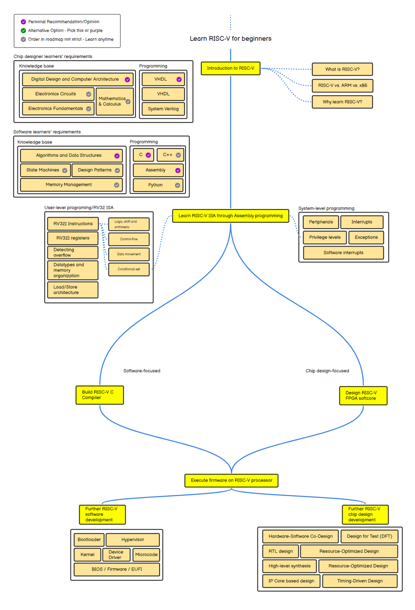

# Learn RISC-V

A community-driven compilation of RISC-V resources and learning material. The list is dynamically updated by the community and categorized based on different contexts of the RISC-V scope, taking into account different levels of experience/knowledge, allowing anyone interested in RISC-V to discover resources (courses, software, documentation, articles) in an organized fashion.

**RISC-V** is an open standard Instruction Set Architecture (ISA) based on established Reduced Instruction Set Computer (RISC) principles.

👋 **Want to learn about RISC-V?** Check out the [Beginner-Level](#-beginner-level-resources) or [Intermediate-Level](#-intermediate-level-resources) learning resources.

---

## 👉 Table of Contents

- [Learn RISC-V](#learn-risc-v)
  - [👉 Table of Contents](#-table-of-contents)
  - [➕ Making Contributions](#-making-contributions)
  - [📙 Resources](#-resources)
    - [Learning Resources for RISC-V](#learning-resources-for-risc-v)
      - [🟢 Beginner-Level Resources](#-beginner-level-resources)
      - [🔵 Intermediate-Level Resources](#-intermediate-level-resources)
    - [Software and Tools](#software-and-tools)
    - [Open RISC-V Implementations](#open-risc-v-implementations)
    - [Available RISC-V Boards, Development Kits, Tablets, and Laptops](#available-risc-v-boards-development-kits-tablets-and-laptops)
    - [Relevant Documentation from RISC-V International](#relevant-documentation-from-risc-v-international)
    - [Articles and Presentations](#articles-and-presentations)

---

## ➕ Making Contributions

We love contributions! Thank you for your interest in contributing to our RISC-V tutorial compilation.

Contributing is easy! Follow these steps:

✔ Browse the beginner and intermediate-level resources [here](#resources) to check if your resource is already included.
✔ If not, go to [Issues](https://github.com/riscv/learn/issues), click `New issue`, and select the "Add Resource" template.
✔ Enter the resource details and submit the issue.
✔ For other contributions, use the General Request issue template [here](https://github.com/riscv/learn/issues/new/choose).
✔ Engage with open issues if you have feedback.

We may contact you for more details before adding contributions.

<!-- ---

## 📚 Learning Roadmap

A roadmap to help beginners select materials to familiarize themselves with RISC-V. Your contributions are welcome.

[View the roadmap web version](https://roadmap.sh/r?id=662706c3351f8e69e690e740) -->

---

## 📙 Resources

### Learning Resources for RISC-V

#### 🟢 Beginner-Level Resources

For those with little or no knowledge of digital logic design. After studying the [Digital Design](#digital-design) book, you may jump to intermediate-level courses like [RVfpga](#computer-architecture-rvfpga).

<!-- Keep this sorted alphabetically =) -->
| Resource  | Author(s) | Description  | Access | Date Added |
|---|---|---|---|---|
| **An Introduction to Assembly Programming with RISC-V** | Prof. Edson Borin | Teaches RISC-V assembly programming concepts. | [Webpage](https://www.ic.unicamp.br/~edson/riscv-book.html) | 2024-05-03 |
| **Architecture 1005: RISC-V Assembly** | OpenSecurityTraining | Security-focused exploration of RISC-V ISAs and extensions. | [Course Videos](https://p.ost2.fyi/courses/course-v1:OpenSecurityTraining2+Arch1005_IntroRISCV+2024_v1/course/) | 2024-15-04 |
| **Basic Computer Architecture** | Smruti R. Sarangi | Computer Architecture. | [Website](https://www.cse.iitd.ac.in/~srsarangi/archbooksoft.html) | 2024-12-27 |
| **Computer Architecture Basics** | CTU Prague - FEE (Pavel Pisa) | Course covering computer architecture basics, including CPU design and speculative execution. | [Course Videos](https://cw.fel.cvut.cz/wiki/courses/b35apo/en/lectures/start) | 2024-16-04 |
| **Creating a RISC-V from scratch!** | Lucas Teske ( Teske's Lab ) | Learning livestream series focused on creating a RV32E that runs on FPGAs | [YouTube (Portuguese)](https://www.youtube.com/playlist?list=PLEP_M2UAh9q52a-w3ZUEChEoG_ROeMa88) | 2024-18-10 |
| **Digital Design & Computer Architecture RISC-V edition** | Sarah L. Harris, David M. Harris | Covers foundational digital logic design and RISC-V processor implementation. | [Amazon](https://www.amazon.com/Digital-Design-Computer-Architecture-RISC-V/dp/0128200642) | 2024-10-01 |
| **Hands-on RISC-V Processor Design** | Rahul Behl | Dive into RISC-V processor design using SystemVerilog. | [QuickSilicon](https://quicksilicon.in/course/riscv) | 2024-10-01 |
| **learn-FPGA episode I: from blinky to RISC-V** | Bruno Levy | Design an FPGA-based RISC-V softcore starting from a basic Verilog blinker. | [GitHub](https://github.com/BrunoLevy/learn-fpga) | 2024-10-01 |
| **LinuxFoundationX: Building a RISC-V CPU Core** | Steve Hoover | Free course on RISC-V microarchitecture design using open-source tools. | [edX Course](https://www.edx.org/learn/design/the-linux-foundation-building-a-risc-v-cpu-core) | 2024-10-01 |
| **Nand2Tetris** | Noam Nisan, Shimon Schocken | Build a computer from logic gates using a hardware simulator. | [Website](https://www.nand2tetris.org/) | 2024-10-01 |
| **RISC-V Assembly Introduction (Portuguese)** | Gabriel G. de Brito | Focus on basics of RISC-V IM architecture with the EGG emulator. | [Course Videos](https://youtube.com/playlist?list=PLFe3Zrf4uj4vlRF21jK3vzfCuSSJ5I_uB) | 2024-04-06 |
| **Step-by-step RISC-V Compiler Development** | Shao-Ce SUN | Practical guide to RISC-V C compiler development. | [Teaching Resources](https://github.com/sunshaoce/rvcc-course) and [Course Videos (Chinese)](https://www.bilibili.com/video/BV1gY4y1E7Ue) | 2024-20-03 |
| **Step-by-step RISC-V OS Development** | Chen Wang | Practical guide for developing RISC-V operating systems. | [Teaching Resources](https://github.com/plctlab/riscv-operating-system-mooc) and [Course Videos (Chinese)](https://www.bilibili.com/video/BV1Q5411w7z5) | 2024-05-03 |
| **The RISC-V Reader: An Open Architecture Atlas** | David Patterson, Andrew Waterman | Introduction to the RISC-V instruction set. | [RISC-V Reader](http://www.riscbook.com/) | 2024-05-03 |

---

#### 🔵 Intermediate-Level Resources

Advanced learning materials for learners familiar with digital logic design.

<!-- Keep this sorted alphabetically =) -->
| Resource  | Author(s) | Description | Access | Date Added |
|---|---|---|---|---|
| **Computer Architecture: A Quantitative Approach (6th Edition)** | David Patterson, John Hennessy | Explores advanced topics like instruction-level parallelism and GPU architectures, using RISC-V. | [Amazon](https://a.co/d/fuvp97D) | 2024-10-01 |
| **Computer Organization & Design (RISC-V Edition)** | David Patterson, John Hennessy | In-depth study of RISC-V ISA and processor implementation. | [Amazon](https://www.amazon.com/Computer-Organization-Design-RISC-V-Architecture/dp/0128203315) | 2024-10-01 |
| **HaDes-V** | Tobias Scheipel | [The Instruction Guide](https://repository.tugraz.at/oer/nytm4-grv34) and this source code template for the [Microcontroller Design, Lab](https://online.tugraz.at/tug_online/ee/ui/ca2/app/desktop/#/slc.tm.cp/student/courses/525082?$scrollTo=toc_overview) is an Open Educational Resource (OER) developed by [Tobias Scheipel](https://www.scheipel.com/), David Beikircher, and Florian Riedl, Embedded Architectures & Systems Group at Graz University of Technology. It is designed for teaching and learning microcontroller design and hardware description languages, using the HaDes-V architecture, a RISC-V-based processor. | [GitHub](https://github.com/tscheipel/HaDes-V/) | 2024-18-12 |
| **Learn with SHAKTI** | Shakti - RISE Lab, IITM | Tutorials on RISC-V assembly programming using the RISC-V toolchain. | [Learn with Shakti](https://shakti.org.in/learn_with_shakti/intro.html) | 2023-21-12 |
| **learn-FPGA episode II: pipelining** | Bruno Levy | Extends the basic RISC-V softcore from episode I with pipelining and performance optimizations. | [GitHub](https://github.com/BrunoLevy/learn-fpga/blob/master/FemtoRV/TUTORIALS/FROM_BLINKER_TO_RISCV/PIPELINE.md) | 2024-10-01 |
| **LinuxFoundationX: RISC-V Toolchain and Compiler Optimization Techniques** | Aditya Kumar | Develop knowledge of RISC-V toolchain internals and compiler optimizations. | [edX Course](https://www.edx.org/learn/computer-programming/the-linux-foundation-risc-v-toolchain-and-compiler-optimization-techniques) | 2024-10-01 |
| **RISC-V Optimization Guide** | RISE Project | Actionable optimization recommendations for RISC-V software developers. | [GitHub](https://gitlab.com/riseproject/riscv-optimization-guide) | 2024-19-02 |
| **RV64GC Linker from Scratch in Go** | Yang Liu, PLCT Lab | Build an RV64GC architecture linker from scratch in Go. | [GitHub](https://github.com/ksco/rvld) and [Course Videos (Chinese)](https://space.bilibili.com/296494084/channel/collectiondetail?sid=857032) | 2024-24-04 |
| **RVfpga (Extended): Understanding Computer Architecture** | Sarah Harris, Daniel Chaver-Martinez | Updated version of the RVfpga course with FPGA and simulation tools. | [RVfpga v3.0 Course Link](https://university.imgtec.com/rvfpga-el2-v3-0-english-downloads-page/) | 2024-06-02 |
| **RVfpga: Computer Architecture with an Industrial RISC-V Core** | Sarah Harris, Daniel Chaver-Martinez | Hands-on learning with commercial RISC-V SoC on FPGAs. | [edX Course](https://www.edx.org/learn/computer-programming/the-linux-foundation-computer-architecture-with-an-industrial-risc-v-core) | 2024-10-01 |
| **Teaching experiences with RVfpga** | ARTECS Group, Complutense University of Madrid | Demonstrates how RVfpga and the Ripes simu lator were used in two courses at UCM: Computer Organization (2nd-year course) and Integrated Systems Architecture (4th-year course). | [GitHub](https://github.com/artecs-group/RVfpga-sim-addons) | 2024-18-10 |
| **Tutorial: RISC-V Vector Extension Demystified** | Thang Tran | In-depth introduction to the RISC-V vector extension. | [YouTube](https://youtu.be/oTaOd8qr53U) | 2024-10-01 |

---

### Software and Tools

Tools to enhance understanding or visualize the RISC-V ISA.

<!-- Keep this sorted alphabetically =) -->
| Tool | Author(s) | Description | Access | Date Added |
|---|---|---|---|---|
| **CREATOR** | Diego Camarmas Alonso, Félix García Carballeira, Alejandro Calderón Mateos, Elías del Pozo Puñal | Didactic simulator for RISC-V assembly programs. | [Website](https://creatorsim.github.io/creator/) | 2023-20-12 |
| **emulsiV** | Guillaume Savaton | Visual simulator for a minimal 32-bit RISC processor. | [Website](https://eseo-tech.github.io/emulsiV/) | 2023-20-12 |
| **Go RISC-V Emulator** | Lucas Teske | A golang implementation of RV32I+M that can run doom | [GitHub](https://github.com/racerxdl/riscv-emulator) | 2024-18-10 |
| **GodBolt** | Matt Godbolt | Online Compiler Explorer that supports GCC/LLVM for RV64 | [Website](https://godbolt.org/) | 2024-18-10 |
| **Online RISC-V Assembler** | Lucas Teske | Online RISC-V Assembler using gnu-assembler in webassembly | [Website](https://riscvasm.lucasteske.dev/) , [Github](https://github.com/racerxdl/riscv-online-asm) | 2024-18-10 |
| **Piscado** | GustavonMartis | RISC-V Simulator written in python during twitch live coding | [Github](https://github.com/gustavonmartins/piscado) | 2024-18-10 |
| **QtRvSim** | CTU Prague | RISC-V simulator with cache and pipeline visualization. | [GitHub](https://github.com/cvut/qtrvsim/) | 2023-20-12 |
| **RISC-V ALE** | Antonio Guimarães | RISC-V Assembly Learning Environment | [Website](https://riscv-programming.org/ale/) | 2024-18-10 |
| **RISC-V Instruction Encoder/Decoder** | LupLab | Online tool for encoding/decoding RISC-V instructions. | [Website](https://luplab.gitlab.io/rvcodecjs/) | 2023-20-12 |
| **Risco-5S** | Julio Nunes Avelar | RISC-V Simulator with RV32IM implementation, built during a few days off. | [Github](https://github.com/JN513/Risco-5S) | 2023-4-11 |
| **RVV Intrinsics Viewer** | dzaima | Documentation for RISC-V vector extension intrinsics. | [Website](https://dzaima.github.io/intrinsics-viewer/) | 2023-20-12 |

---

### Open RISC-V Implementations

Explore open RISC-V implementations for hands-on learning.

<!-- Keep this sorted alphabetically =) -->
| Name | Description | Access | Date Added |
|---|---|---|---|
| **AUK-V-Aethia** | AUK-V RV32I CPU. | [Github](https://github.com/veeYceeY/AUK-V-Aethia) | 2024-18-10 |
| **CVA6** | The CORE-V CVA6 is an Application class 6-stage RISC-V CPU capable of booting Linux | [Github](https://github.com/openhwgroup/cva6) | 2024-18-10 |
| **CV32E40P** | CV32E40P is an in-order 4-stage RISC-V RV32IMFCXpulp CPU based on RI5CY from PULP-Platform. | [Github](https://github.com/openhwgroup/cv32e40p) | 2024-18-10 |
| **DarkRISCV** | Small RV32-E / I soft-core CPU optimized for FPGAs. | [GitHub](https://github.com/darklife/darkriscv) | 2024-18-10 |
| **Grande Risco-5** | RISC-V RV32I multi-cycle processor with a 5-stage pipeline, designed for educational purposes. | [Github](https://github.com/JN513/Grande-Risco-5) | 2024-06-11 |
| **Hazard3** | 3-stage RV32IMACZb* processor with debug | [Github](https://github.com/Wren6991/Hazard3) |2024-19-12 | 
| **Kronos** | Kronos is a 3-stage in-order RISC-V RV32I_Zicsr_Zifencei core geared towards FPGA implementations. | [Github](https://github.com/SonalPinto/kronos) | 2024-18-10 |
| **Leaf** | Leaf is a small RV32I SoC for portable applications done in VHDL and implemented both in FPGA and ASIC. | [Github](https://github.com/britovski/leaf) | 2024-23-10 |
| **Maestro** | A 5 stage-pipeline RV32I implementation in VHDL. | [Github](https://github.com/Artoriuz/maestro) | 2024-18-10 |
| **Mriscv** | A 32-bit Microcontroller featuring a RISC-V core. | [Github](https://github.com/onchipuis/mriscv) | 2024-18-10 |
| **NEORV32** | MCU-class RISC-V soft-core CPU, customizable and extensible. | [GitHub](https://github.com/stnolting/neorv32) | 2024-01-11 |
| **NERV** | Naive Educational RISC V processor | [Github](https://github.com/YosysHQ/nerv) | 2024-18-10 |
| **NoX** | Small RISC-V (RV32I) core written in SystemVerilog | [GitHub](https://github.com/aignacio/nox) | 2024-21-10 |
| **Pequeno** | Pipelined in-order RISC-V CPU core compliant with RV32I. | [GitHub](https://github.com/iammituraj/pequeno_riscv) | 2023-20-12 |
| **PicoRV32** | A Size-Optimized RISC-V CPU | [Github](https://github.com/YosysHQ/picorv32) | 2024-18-10 |
| **ReonV** | ReonV is a modified version of the Leon3, a synthesisable VHDL model of a 32-bit processor originally compliant with the SPARC V8 architecture, now changed to RISC-V ISA. | [Github](https://github.com/lcbcFoo/ReonV) | 2024-18-10 |
| **Riskow** | Toy RV32-E done from scratch during livestreams that runs on cheap FPGAs | [Github](https://github.com/racerxdl/riskow) | 2024-18-10 |
| **Riscado-V** | Simple RISC-V (RV32I) implementation in verilog | [Github](https://github.com/zxmarcos/riscado-v) | 2024-18-10 |
| **Risco-5** | Multi-cycle RISC-V processor with RV32I/E[M] implementation, built during a few days off | [Github](https://github.com/JN513/Risco-5) | 2024-18-10 |
| **RISC-V Steel** | 32-bit RISC-V processor core (RV32I + Zicsr + Machine mode) | [Github](https://github.com/riscv-steel/riscv-steel) | 2024-18-10 |
| **RPU** | Basic RISC-V CPU implementation in VHDL. | [Github](https://github.com/Domipheus/RPU) | 2024-18-10 |
| **RSD** | RSD: RISC-V Out-of-Order Superscalar Processor | [Github](https://github.com/rsd-devel/rsd) | 2024-18-10 |
| **SERV** | SERV - The SErial RISC-V CPU. | [Github](https://github.com/olofk/serv) | 2024-18-10 |
| **TinyRiscv** | A very simple and easy to understand RISC-V core | [Github](https://github.com/liangkangnan/tinyriscv) | 2024-18-10 |
| **VexRiscv** | A FPGA Friendly 32 bit RISC-V CPU implementation | [Github](https://github.com/SpinalHDL/VexRiscv) | 2024-18-10 |

---

### Available RISC-V Boards, Development Kits, Tablets, and Laptops

<!-- Keep this sorted alphabetically =) -->
| Board or Dev Kit | Company | SoC | RISC-V Core | Date Added |
|---|---|---|---|---|
| [**Banana Pi F3**](https://docs.banana-pi.org/en/BPI-F3/BananaPi_BPI-F3) | Banana Pi | SpacemiT K1 | Octa-Core X60 | 2024-01-11 |
| [**DC Roma II**](https://deepcomputing.io/product/dc-roma-risc-v-laptop-ii/) | DeepComputing | SpacemiT K1 | Octa-Core X60™ | 2024-31-10 |
| [**HiFive Premier P550**](https://www.sifive.com/boards/hifive-premier-p550) | SiFive | ESWIN EIC7700X | SiFive Quad-Core P550 | 2024-31-10 |
| [**HiFive Unmatched**](https://www.sifive.com/boards/hifive-unmatched) | SiFive | SiFive U74‑MC | 64-bit S7 | 2024-31-10 |
| [**HiFive1 Rev B**](https://www.sifive.com/boards/hifive1-rev-b) | SiFive | FE310-G002 | 32-bit E31 | 2024-31-10 |
| [**Kendryte K230**](https://developer.canaan-creative.com/k230/dev/zh/CanMV_K230_%E6%95%99%E7%A8%8B.html) | Canaan Technology | K230 | Dual-Core T-HEAD C908 | 2024-01-11 |
| [**LicheeRV D1**](https://wiki.sipeed.com/hardware/en/lichee/RV/Dock.html) | Sipeed | AllWinnerD1 | Single-Core T-Head C906 | 2024-31-10 |
| [**LicheeRV Nano**](https://wiki.sipeed.com/hardware/en/lichee/RV_Nano/1_intro.html) | Sipeed | SG2002 | Single-Core T-HEAD C906 | 2024-31-10 |
| [**LicheePi 4A**](https://wiki.sipeed.com/hardware/en/lichee/th1520/lpi4a/1_intro.html) | Sipeed | TH1520 | Quad-Core T-HEAD C910 | 2024-31-10 |
| [**LicheeBook 4A**](https://wiki.sipeed.com/hardware/en/lichee/th1520/lbook4a/lbook4a.html) | Sipeed | TH1520 | Quad-Core T-HEAD C910 | 2024-31-10 |
| [**LicheePi Console 4A**](https://wiki.sipeed.com/hardware/en/lichee/th1520/lcon4a/lcon4a.html) | Sipeed | TH1520 | Quad-Core T-HEAD C910 | 2024-31-10 |
| [**LicheePi 3A**](https://wiki.sipeed.com/hardware/en/lichee/K1/lpi3a/1_intro.html) | Sipeed | SpacemiT K1 | Octa-Core X60 | 2024-31-10 |
| [**VisionFive 2**](https://www.starfivetech.com/en/site/boards) | StarFiveTech | JH7110 | Quad-Core Sifive u74 | 2024-31-10 |
| [**Milk-V Duo**](https://milkv.io/docs/duo/getting-started/duo) | Milk-V | CV1800B | T-HEAD C906 | 2024-31-10 |
| [**Milk-V Duo256M**](https://milkv.io/docs/duo/getting-started/duo256m) | Milk-V | SG2002 | T-HEAD C906 | 2024-31-10 |
| [**Milk-V Duo S**](https://milkv.io/docs/duo/getting-started/duos) | Milk-V | SG2000 | T-HEAD C906 | 2024-31-10 |
| [**Milk-V Mars**](https://milkv.io/mars) | Milk-V | JH7110 | Quad-Core Sifive u74 | 2024-31-10 |
| [**Milk-V Meles**](https://milkv.io/meles) | Milk-V | TH1520 | Quad-Core T-HEAD C910 | 2024-31-10 |
| [**Milk-V Pioneer**](https://milkv.io/pioneer) | Milk-V | SG2042 | 64 Cores T-HEAD C910 | 2024-31-10 |
| [**Milk-V Vega**](https://milkv.io/vega) | Milk-V | FSL1030M | UX608 Core | 2024-31-10 |
| [**Milk-V Jupiter**](https://milkv.io/jupiter) | Milk-V | SpacemiT K1 | Octa-Core X60 | 2024-31-10 |
| [**Ox64**](https://pine64.com/product/star64-model-a-8gb-single-board-computer/) | Pine64 | BL808 | T-HEAD C906, T-HEAD E907, T-HEAD E902 | 2024-31-10 |
| [**OK7110-C**](https://www.forlinx.net/product/jh7110-single-board-computer-riscv-142.html) | ForLinx | JH7110 | Quad-Core Sifive u74 | 2024-31-10 |
| [**PineTab-V**](https://pine64.com/product/pinetab-v-10-1-8gb-128gb-risc-v-based-linux-tablet-with-detached-backlit-keyboard/) | Pine64 | JH7110 | Quad-Core Sifive u74 | 2024-31-10 |
| [**Raspberry Pi Pico 2**](https://www.raspberrypi.com/products/raspberry-pi-pico-2/) | Raspberry Pi | RP2350 | Dual-Core Hazard3 | 2024-19-12 | 
| [**Star 64**](https://pine64.com/product/star64-model-a-8gb-single-board-computer/) | Pine64 | JH7110 | Quad-Core Sifive u74 | 2024-31-10 |
| [**SpacemiT MUSE Pi**](https://www.spacemit.com/spacemit-muse-pi/) | SpacemiT | SpacemiT M1 | Octa-Core X60 | 2024-01-11 |

---

### Relevant Documentation from RISC-V International

<!-- Keep this sorted alphabetically =) -->
| Document | Description | Access |
|---|---|---|
| **Getting Started Guide** | Overview of RISC-V technical organizations for new members | [Google Doc](https://docs.google.com/document/d/1Qjf6BwMmtqTfzftr3WWf2bRv8Cl4f0qZrWWbr0jCBSU/edit) |
| **Member Benefits Deck** | Familiarize with RISC-V member benefits and community scope | [Google Doc](https://docs.google.com/presentation/d/1Q8gMcVwzqdqym3ugl_Q-LW0KMUApO-v8mWVdjqQE-MI/edit#slide=id.gf097992cc3_0_1819) |
| **RISC-V Lifecycle Guide** | Guide for RISC-V members participating in specification writing and open-source contributions | [Google Doc](https://docs.google.com/document/d/1Au3veNdNJQKPq-oiQRKTzdgmM72FDaqZOKeH7sOnG04/) |
| **RISC-V Repository Map** | Central directory of RISC-V-related repositories | [GitHub Repo Map](https://wiki.riscv.org/display/HOME/GitHub+Repo+Map) |
| **RISC-V Technical Wiki** | Central point for technical information related to RISC-V | [Wiki](https://wiki.riscv.org) |

---

### Articles and Presentations

<!-- Keep this sorted alphabetically =) -->
| Resource | Author(s) | Description | Access |
|---|---|---|---|
| **Design of the RISC-V Instruction Set Architecture** | Andrew Waterman | PhD dissertation on the structure of the RISC-V ISA. | [PDF](https://www2.eecs.berkeley.edu/Pubs/TechRpts/2016/EECS-2016-1.pdf) |
| **Past, Present and Future of RISC-V** | Krste Asanović | Overview of RISC-V’s evolution | [YouTube](https://www.youtube.com/watch?v=RrVRMFjYti0) |
| **Is RISC-V the Future?** | Roddy Urquhart | Examination of RISC-V’s future potential | [Article](https://semiengineering.com/is-risc-v-the-future) |
